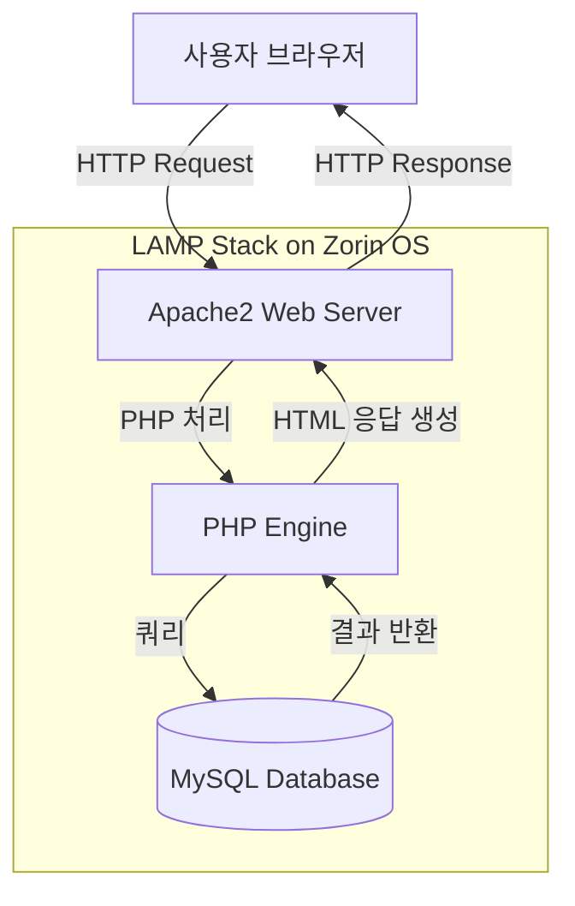
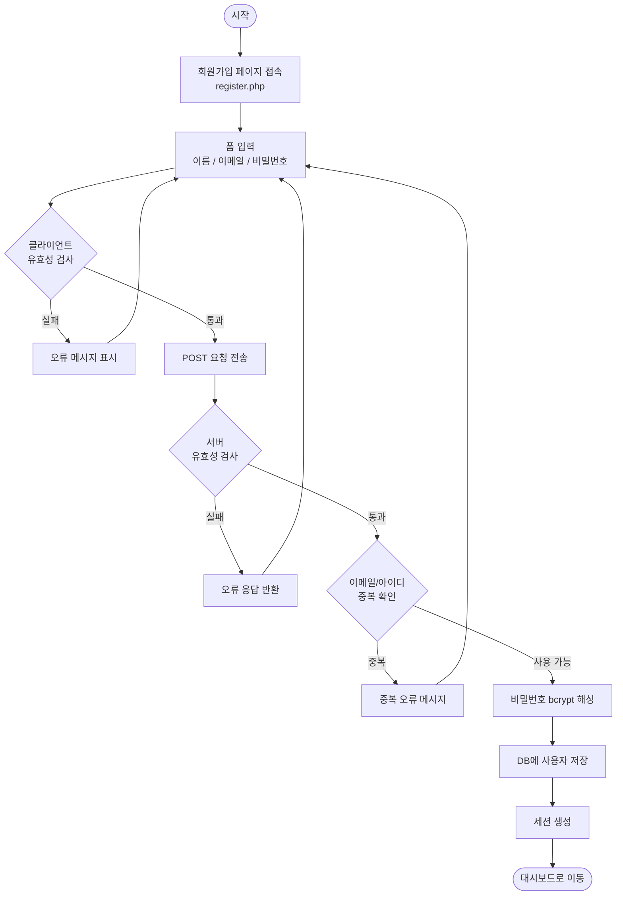
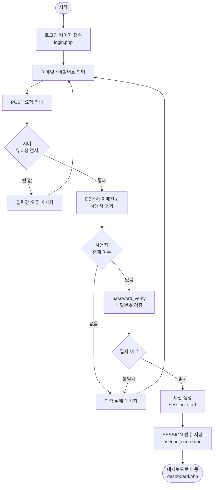
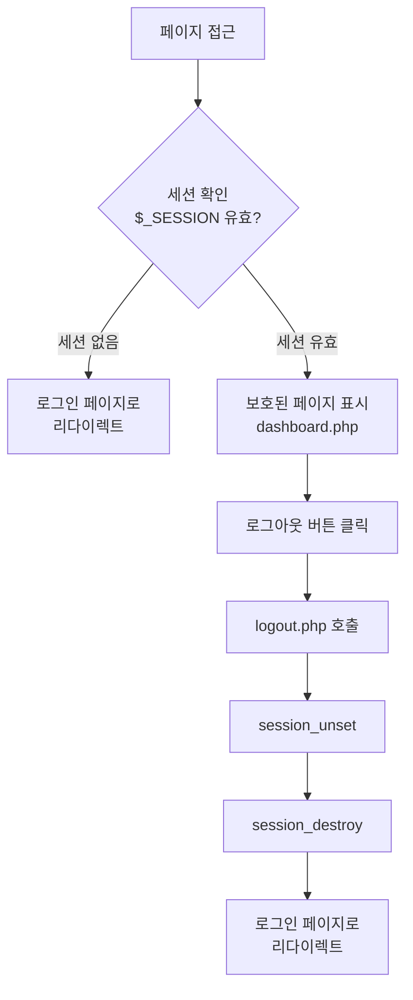
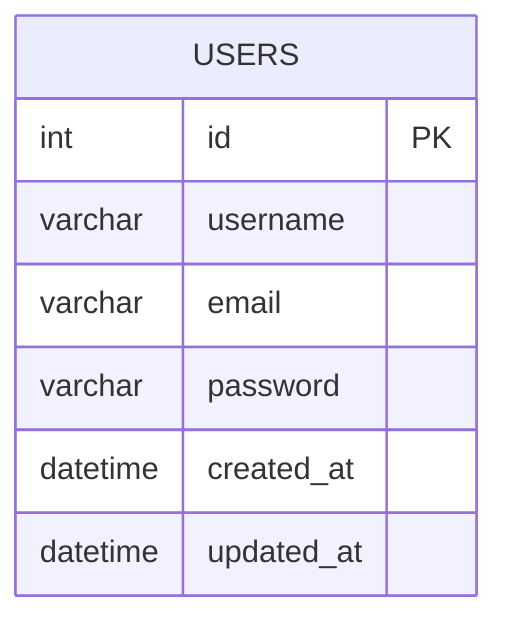

# LAMP Stack 로그인/회원가입 프로젝트

## 프로젝트 개요

Zorin OS에 설치된 LAMP 스택(Linux, Apache, MySQL, PHP)을 활용하여 사용자 인증 시스템(로그인/회원가입)을 구현하는 웹 애플리케이션입니다.

---

## 기술 스택

| 구성요소 | 역할 |
|---------|------|
| Linux (Zorin OS) | 운영체제 |
| Apache2 | 웹 서버 |
| MySQL | 데이터베이스 |
| PHP | 서버 사이드 스크립트 |
| HTML/CSS | 프론트엔드 |

---

## 프로젝트 구조

```
/var/www/html/auth/
├── index.php           # 메인 페이지 (로그인 후 리다이렉트)
├── login.php           # 로그인 페이지
├── register.php        # 회원가입 페이지
├── logout.php          # 로그아웃 처리
├── dashboard.php       # 로그인 후 대시보드
├── config/
│   └── db.php          # 데이터베이스 연결 설정
├── includes/
│   ├── auth.php        # 인증 함수 모음
│   └── validate.php    # 유효성 검사 함수
└── assets/
    ├── css/
    │   └── style.css   # 스타일시트
    └── js/
        └── main.js     # 클라이언트 스크립트
```

---

## 데이터베이스 스키마

```sql
CREATE DATABASE auth_db;

CREATE TABLE users (
    id          INT AUTO_INCREMENT PRIMARY KEY,
    username    VARCHAR(50)  NOT NULL UNIQUE,
    email       VARCHAR(100) NOT NULL UNIQUE,
    password    VARCHAR(255) NOT NULL,  -- bcrypt 해시
    created_at  DATETIME DEFAULT CURRENT_TIMESTAMP,
    updated_at  DATETIME DEFAULT CURRENT_TIMESTAMP ON UPDATE CURRENT_TIMESTAMP
);
```

---

## 플로우 다이어그램

### 1. 전체 시스템 아키텍처



---

### 2. 회원가입 흐름



---

### 3. 로그인 흐름



---

### 4. 세션 및 로그아웃 흐름



---

### 5. 데이터베이스 연동 구조



---

## 보안 고려사항

- **비밀번호 해싱**: `password_hash()` + bcrypt 알고리즘 사용
- **SQL 인젝션 방지**: PDO Prepared Statements 사용
- **XSS 방지**: `htmlspecialchars()`로 출력값 이스케이프
- **세션 고정 공격 방지**: 로그인 성공 시 `session_regenerate_id(true)` 호출
- **CSRF 방지**: 폼에 토큰 삽입 및 검증

---

## 개발 환경 설정

```bash
# Apache, MySQL, PHP 설치 확인
sudo systemctl status apache2
sudo systemctl status mysql

# 웹 루트 디렉토리 이동
cd /var/www/html

# 프로젝트 디렉토리 생성
sudo mkdir auth
sudo chown -R $USER:$USER /var/www/html/auth
```
